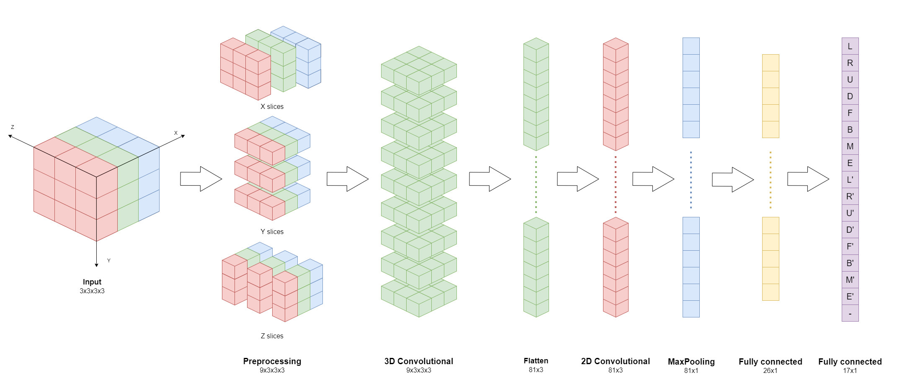

# cubenet
Neural network model for solving Rubik's cube.

# Model architecture

Model consists of 1x 3D Conv, 1x 2D Conv and 2x FC layers:

For 3x3x3 Rubik's cube representation I'm using [this python library](https://github.com/pglass/cube) by Paul Glass. I've created `Ecube` class inheriting `Cube` class from this library, to pass Rubik's cube as an input to neural network model (see method usage [here](#ecube)). Each individual color of cube has it's ID as a square of two. For example, if colors of cube are red, green, blue, ... then e.g. red will have an ID $2^0 = 1$, green - $2^1 = 2$, blue - $2^2 = 4$. 

# ECube