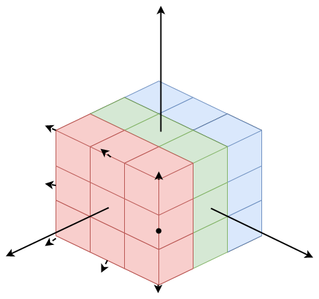

# cubenet
Neural network model for solving Rubik's cube.

# Model architecture

Model consists of 1x 3D Conv, 1x 2D Conv and 2x FC layers:

For 3x3x3 Rubik's cube representation I'm using [this python library](https://github.com/pglass/cube) by Paul Glass. I've created `Ecube` class inheriting `Cube` class from this library, to pass Rubik's cube as an input to neural network model (see method usage [here](#ecube)). 

## Preprocessing

Each individual color of cube has it's ID as a square of two. For example, if colors of cube are red, green, blue, ... then red will have an ID `2^0 = 1`, green - `2^1 = 2`, blue - `2^2 = 4`, etc.
Every piece are representated by individual 3-vectors characterizing location and colors of pieces. 
1. First, XOR of IDs of a piece colors is calculated, so we get an ID of a piece. For example, if a piece has colors with ids 1, 2 and 4, then the ID of this piece is `XOR(1, 2, 4) = 7` and `XOR(001, 010, 100) = 111` in binary representation. 
1. Second, calculated piece ID is multiplied by piece location normal 3-vector. Normal vectors are calculated with the origin in the center of a cube:

# ECube